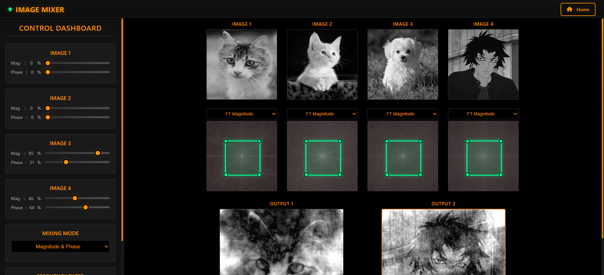
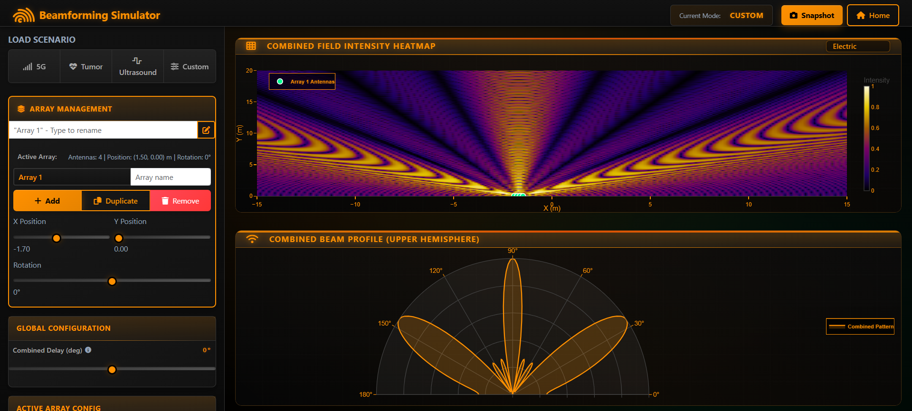

# Image Processing & Beamforming Suite 🌊

<div align="center">

<br/>
<br/>

**Advanced Digital Signal Processing & Antenna Simulation Platform**

<br/>

[](https://www.python.org/)
[](https://www.djangoproject.com/)
[](https://developer.mozilla.org/en-US/docs/Web/JavaScript)
[](https://plotly.com/)
[](https://getbootstrap.com/)

<br/>

<p align="center" style="display:flex; align-items:flex-start; gap:10px;">
  
  
</p>

</div>

---

## 📖 About

The Image Processing & Beamforming Suite is a comprehensive web-based platform designed for visualization and analysis of digital signals, with a dual focus on advanced image processing and phased array antenna simulation. Built with Django and architected using Object-Oriented JavaScript, it provides professional-grade interactive tools for frequency domain manipulation and antenna beamforming analysis.

This suite bridges the gap between theoretical signal processing concepts and practical, real-time visualization, making it an invaluable tool for students, researchers, and engineers working in fields such as medical imaging, telecommunications, radar systems, and ultrasound technology.

### Why Image Processing & Beamforming Suite?

- 🎯 **Dual-Purpose Platform** - combines image processing and antenna simulation in one unified interface
- 🔬 **Real-Time Analysis** - instant visualization of Fourier transforms and beam patterns
- 🎨 **Interactive Controls** - dynamic sliders and filters for hands-on experimentation
- 📊 **Professional Visualization** - powered by Plotly.js for publication-quality graphics
- 🏗️ **Clean Architecture** - object-oriented JavaScript for maintainable, scalable code
- 🌐 **Web-Based** - no installation required, runs entirely in your browser

---

## ✨ Features

### 🖼️ Image Processing Mixer

An advanced toolkit for Fourier Transform (FT) analysis and multi-image frequency domain manipulation.

- **Frequency Domain Analysis** - View and manipulate Magnitude, Phase, Real, and Imaginary components of up to four uploaded images simultaneously
- **Multi-Component Visualization** - Display FT components side-by-side for comparative analysis
- **Region of Interest Filtering** - Interactive filters to isolate inner (low-frequency) or outer (high-frequency) regions with real-time preview
- **Dynamic Component Mixing** - Blend frequency components from different images:
  - Mix Image A's Magnitude with Image B's Phase
  - Combine Real components from one image with Imaginary from another
  - Weighted sliders for precise control over mixing ratios
- **Real-Time Adjustments** - Live brightness and contrast controls for output refinement
- **Inverse Transform Preview** - Instantly see the spatial domain result of frequency manipulations
- **Multi-Image Support** - Work with up to 4 images simultaneously for complex comparative studies

### 📡 Beamforming Simulator

A professional-grade interactive simulator for phased array antenna systems with advanced visualization capabilities.

- **Array Management System**:
  - Add, duplicate, or remove multiple antenna arrays
  - Custom naming and color coding for each array
  - 2D spatial positioning with precise coordinate control
  
- **Flexible Geometry Control**:
  - **Linear Arrays**: Classic uniform linear array (ULA) configuration
  - **Curved Arrays**: Arc-based geometries for specialized applications
  - Adjustable element counts (1-32 elements per array)
  - Spacing control: Absolute (meters) or wavelength-based (λ)
  
- **Real-Time Visualization**:
  - **Field Intensity Heatmap**: 2D visualization of constructive and destructive interference patterns across the observation plane
  - **Beam Profile (Polar Plot)**: Combined radiation pattern in the upper hemisphere showing main lobe and side lobes
  - Interactive color scales and zoom capabilities
  
- **Application Presets**:
  - **5G Communications**: Optimized array configuration for mobile networks
  - **Tumor Detection**: Medical imaging parameters for tissue analysis
  - **Ultrasound**: Diagnostic imaging setup for medical applications
  
- **Advanced Controls**:
  - Frequency adjustment (1-10 GHz range)
  - Individual array phase and amplitude control
  - Steering angle configuration
  - Real-time pattern updates

---

## 🚀 Getting Started

### Prerequisites

- **Python 3.8+**
- **pip** (Python package manager)
- Modern web browser (Chrome, Firefox, Safari, or Edge)
- **Git** (for cloning the repository)

### Installation

1. **Clone the repository**
```bash
git clone https://github.com/yourusername/ImageProcessingAndBeamforming.git
cd ImageProcessingAndBeamforming
```

2. **Create a virtual environment** (recommended)
```bash
python -m venv venv

# On Windows
venv\Scripts\activate

# On macOS/Linux
source venv/bin/activate
```

3. **Install dependencies**
```bash
pip install -r requirements.txt
```

   Or install manually:
```bash
pip install django numpy scipy pillow
```

4. **Run database migrations**
```bash
python manage.py migrate
```

5. **Create necessary directories** (if not already present)
```bash
mkdir -p media static/uploads
```

6. **Start the development server**
```bash
python manage.py runserver
```

7. **Open your browser** and navigate to `http://127.0.0.1:8000/`

---

## 💻 Usage

### 🖼️ Image Processing Mixer

#### Basic Workflow

1. **Navigate to Image Mixer** from the home dashboard
2. **Upload Images**: Click on upload zones to select up to 4 images (JPEG, PNG supported)
3. **Select FT Component**: Choose which component to view (Magnitude, Phase, Real, Imaginary)
4. **Apply Filters** (optional):
   - Toggle "Inner Region" to keep low frequencies
   - Toggle "Outer Region" to keep high frequencies
   - Adjust filter size using the slider
5. **Mix Components**:
   - Select source images for magnitude and phase
   - Adjust mixing weights using sliders (0-100%)
6. **Fine-Tune Output**:
   - Adjust brightness slider
   - Adjust contrast slider
7. **View Results**: See the reconstructed image update in real-time

#### Advanced Techniques

- **Hybrid Images**: Mix low frequencies from one image with high frequencies from another
- **Phase Importance Study**: Swap phases between images to understand phase significance
- **Texture Analysis**: Isolate specific frequency bands to analyze image textures
- **Edge Detection**: Use high-pass filtering (outer region) to emphasize edges

### 📡 Beamforming Simulator

#### Basic Workflow

1. **Navigate to Beamforming** from the home dashboard
2. **Add Array**: Click "Add Phased Array" button
3. **Configure Array**:
   - Set array name and color
   - Choose geometry (Linear/Curved)
   - Set element count (1-32)
   - Adjust element spacing
   - Position array in 2D space (X, Y coordinates)
4. **Adjust Global Parameters**:
   - Set operating frequency (1-10 GHz)
   - Configure observation grid resolution
5. **View Visualizations**:
   - Examine field intensity heatmap
   - Analyze polar beam pattern
6. **Experiment**: Add multiple arrays and observe interference patterns

#### Using Presets

1. Click on one of the preset buttons:
   - **5G**: Loads optimized configuration for mobile communications
   - **Tumor Detection**: Sets up medical imaging parameters
   - **Ultrasound**: Configures for diagnostic applications
2. Modify preset parameters as needed
3. Observe how different configurations affect beam patterns

### 💡 Tips for Best Results

**Image Processing:**
- Use high-resolution images (512x512 or larger) for better frequency detail
- Grayscale images work best for learning FT concepts
- Try images with distinct features (faces, buildings, patterns)
- Experiment with complementary images for mixing

**Beamforming:**
- Start with a single array to understand basic patterns
- Use linear geometry for initial learning
- Set element spacing to 0.5λ for optimal results
- Add multiple arrays to study interference effects
- Adjust frequency to see wavelength effects on beam width

---

## 📁 Project Structure

```
ImageProcessingAndBeamforming/
├── core/
│   └── imagean/
│       ├── __pycache__/
│       └── imagean.py              # Core image processing algorithms
├── ImageProcessingAndBeamforming/
│   ├── __pycache__/
│   ├── __init__.py
│   ├── asgi.py
│   ├── settings.py                  # Django configuration
│   ├── urls.py                      # URL routing
│   ├── views.py                     # View controllers
│   └── wsgi.py
├── media/
│   ├── beamforming-photo.png        # Documentation images
│   └── Image_mixer_photo.png
├── static/
│   ├── css/
│   │   ├── beamforming.css          # Beamforming styles
│   │   ├── home.css                 # Dashboard styles
│   │   └── image.css                # Image mixer styles
│   ├── img/
│   │   └── logo.png                 # Application logo
│   └── js/
│       ├── Antenna.js               # Antenna element class
│       ├── PhasedArray.js           # Phased array class
│       ├── ImageMixer.js            # Image processing logic
│       ├── Filter.js                # Frequency domain filters
│       └── main.js                  # Main application logic
├── templates/
│   ├── beamforman.html              # Beamforming simulator page
│   ├── home.html                    # Dashboard page
│   └── image.html                   # Image mixer page
├── .gitignore
├── db.sqlite3                       # SQLite database
├── manage.py                        # Django management script
├── README.md                        # This file
└── requirements.txt                 # Python dependencies
```

---

## 🔧 How It Works

### Image Processing Pipeline

1. **Image Upload & Preprocessing**
   - Accepts JPEG/PNG images via browser
   - Converts to grayscale (optional)
   - Normalizes dimensions for consistent processing

2. **Fourier Transform Analysis**
   - Applies 2D Fast Fourier Transform (FFT)
   - Extracts four components:
     - **Magnitude**: Amplitude of frequency components
     - **Phase**: Angular information of frequencies
     - **Real**: Cosine components
     - **Imaginary**: Sine components
   - Displays with logarithmic scaling for visibility

3. **Frequency Domain Filtering**
   - **Inner Region (Low-Pass)**: Keeps low frequencies, smooths image
   - **Outer Region (High-Pass)**: Keeps high frequencies, emphasizes edges
   - Circular or rectangular masks applied in frequency space

4. **Component Mixing**
   - Combines magnitude from one image with phase from another
   - Weighted blending using adjustable sliders
   - Demonstrates importance of phase vs. magnitude in image perception

5. **Inverse Transform & Display**
   - Applies Inverse FFT to reconstruct spatial domain image
   - Real-time brightness/contrast adjustments
   - Displays final processed output

### Beamforming Calculation Engine

1. **Array Geometry Setup**
   - Defines antenna element positions based on:
     - Linear: Uniform spacing along a line
     - Curved: Elements along an arc
   - Calculates wavelength from frequency: λ = c/f

2. **Signal Propagation Modeling**
   - For each point in observation space:
     - Calculates distance from each antenna element
     - Computes phase delay: φ = 2π × distance / λ
     - Applies element-specific phase offsets

3. **Field Superposition**
   - Sums complex signals from all elements:
     - E_total = Σ A_n × e^(j(ωt - k·r_n + φ_n))
   - Accounts for:
     - Amplitude weighting
     - Phase steering
     - Geometric path differences

4. **Visualization Generation**
   - **Heatmap**: Intensity = |E_total|² across 2D grid
   - **Polar Plot**: Beam pattern in angular coordinates
   - Plotly.js renders interactive, zoomable plots
   - Color scales represent signal strength

### Technologies Used

- **Backend Framework**: Django (Python) - MVC architecture, routing, and server logic
- **Frontend Structure**: HTML5, CSS3, Bootstrap 5 - responsive, modern UI
- **Visualization Engine**: Plotly.js - interactive scientific plotting
- **Image Processing**: Canvas API, JavaScript FFT libraries
- **Signal Processing**: NumPy, SciPy (server-side calculations)
- **Architecture**: Object-Oriented JavaScript - classes for Antenna, PhasedArray, Filter, ImageMixer
- **Styling**: Custom CSS with dark theme, animated particles, glassmorphism effects

---

## 📚 Educational Applications

### For Students

- **Signal Processing Courses**: Hands-on learning of Fourier Transform concepts
- **Antenna Theory**: Visualize array factor patterns and steering principles
- **Image Processing Labs**: Experiment with frequency domain filtering techniques
- **Electromagnetics**: Understand wave interference and superposition

### For Researchers

- **Algorithm Prototyping**: Quickly test beamforming algorithms
- **Medical Imaging**: Simulate ultrasound and tumor detection scenarios
- **Telecommunications**: Design and analyze 5G antenna arrays
- **Pattern Optimization**: Iterate on array configurations for desired beam shapes

### For Educators

- **Classroom Demonstrations**: Real-time visualization during lectures
- **Assignment Platform**: Students can submit processed images or array designs
- **Concept Illustration**: Show magnitude vs. phase importance in image reconstruction
- **Interactive Labs**: Replace static textbook diagrams with dynamic simulations

---

## 🎯 Use Cases

### Image Processing

1. **Hybrid Image Creation**: Combine low frequencies from one image with high frequencies from another to create images that change appearance based on viewing distance
2. **Phase Scrambling**: Demonstrate that phase carries more structural information than magnitude
3. **Texture Analysis**: Isolate specific frequency bands to study image textures
4. **Compression Studies**: Understand which frequencies can be discarded with minimal perceptual impact

### Beamforming

1. **5G Base Station Design**: Optimize antenna array configurations for mobile coverage
2. **Medical Ultrasound**: Simulate focused beams for tissue imaging
3. **Radar Systems**: Design arrays for target detection and tracking
4. **Acoustic Beamforming**: Apply principles to microphone arrays for sound source localization
5. **Satellite Communications**: Analyze phased arrays for satellite uplinks/downlinks

---

## 🔮 Future Enhancements

- [ ] 3D beamforming visualization
- [ ] Video processing support for image mixer
- [ ] Export beam patterns as publication-ready figures
- [ ] Machine learning-based automatic array optimization
- [ ] Support for non-uniform array geometries
- [ ] Real-time collaboration features
- [ ] Mobile app version
- [ ] Integration with external simulation tools (MATLAB, GNU Radio)
- [ ] Batch processing for multiple images
- [ ] Advanced filter types (Gaussian, Butterworth, custom)

---

## 🤝 Contributing

Contributions are welcome! Please follow these steps:

1. Fork the repository
2. Create a feature branch (`git checkout -b feature/AmazingFeature`)
3. Commit your changes (`git commit -m 'Add some AmazingFeature'`)
4. Push to the branch (`git push origin feature/AmazingFeature`)
5. Open a Pull Request

Please ensure your code follows the existing style and includes appropriate documentation.

---

## 📄 License

This project is licensed under the MIT License - see the LICENSE file for details.

---

## 🙏 Acknowledgments

- Fourier Transform algorithms inspired by classical signal processing theory
- Beamforming calculations based on phased array antenna principles
- UI design influenced by modern dashboard aesthetics
- Special thanks to the open-source community for tools like Django, Plotly.js, and Bootstrap

---

## 👥 Team

- **Alhussien Ayman** - Image Processing Lead
- **Mohamed Elsayyed Attallah** - Beamforming Algorithms
- **Abdullah Khalefa** - Frontend Development
- **Ahmed Elshinawy** - System Architecture

> Built with ❤️ as a collaborative project in Digital Signal Processing

---

## 📞 Support

Having issues or questions? Here are some resources:

- **Documentation**: Check the in-app help sections
- **Issues**: Open an issue on GitHub for bug reports
- **Email**: Contact the development team
- **Discussion**: Join our community forum (coming soon)

---

## 📈 Version History

- **v1.0.0** (Current)
  - Initial release
  - Image mixer with 4-image support
  - Beamforming simulator with linear and curved arrays
  - Three application presets
  - Real-time visualization

---

<div align="center">

**⭐ Star this repository if you find it helpful!**

Made with Python, JavaScript, and a passion for signal processing

</div>